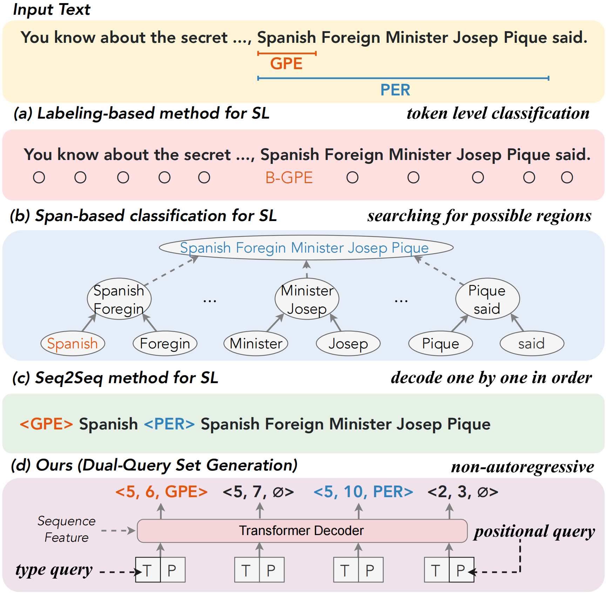

# [Sequence Labeling as Non-autoregressive Dual-Query Set Generation](https://ieeexplore.ieee.org/abstract/document/10420440)

This repository is the official implementation of our paper "[Sequence Labeling as Non-autoregressive Dual-Query Set Generation](https://ieeexplore.ieee.org/abstract/document/10420440)".


## 🗂️ Table of Contents

- [Sequence Labeling as Non-autoregressive Dual-Query Set Generation](#Sequence-Labeling-as-Non-autoregressive-Dual-Query-Set-Generation)
  - [🌟 Overview](#-overview)
  - [📕 Requirements](#-requirements)
  - [📚 Dataset](#-dataset)
  - [🚀 Let's Train](#-training)
  - [🚁 Evaluation](#-evaluation)
  - [❗️ Note](#-note)
  - [Citation](#citation)

## 🌟 Overview

<div align=center>

</div>

Sequence labeling is a crucial task in the NLP community that aims at identifying and assigning spans within the input sentence. It has wide applications in various fields such as information extraction, dialogue system, and sentiment analysis. However, previously proposed span-based or sequence-to-sequence models conduct locating and assigning in order, resulting in problems of error propagation and unnecessary training loss, respectively. This paper addresses the problem by reformulating the sequence labeling as a non-autoregressive set generation to realize locating and assigning in parallel. Herein, we propose a Dual-Query Set Generation (DQsetGen) model for unified sequence labeling tasks. Specifically, the dual-query set, including a prompted type query and a positional query with anchor span, is fed into the non-autoregressive decoder to probe the spans which correspond to the positional query and have similar patterns with the type query. By avoiding the autoregressive nature of previous approaches, our method significantly improves efficiency and reduces error propagation. Experimental results illustrate that our approach can obtain superior performance on 5 sub-tasks across 11 benchmark datasets. The non-autoregressive nature of our method allows for parallel computation, achieving faster inference speed than compared baselines. In conclusion, our proposed non-autoregressive dual-query set generation method offers a more efficient and accurate approach to sequence labeling tasks in NLP. Its advantages in terms of performance and efficiency make it a promising solution for various applications in data mining and other related fields.

## 📕 Requirements

To run the code, you should install the dependency libraries.

```setup
pip install -r requirements.txt
```

## 📚 Dataset

We list the datasets used in our paper into `data/datasets/` folder.

The expected structure of files is:

```
DQSetGen
 |-- configs	          # the configs of train/eval
 |    |-- ace05.conf 
 |    |-- ...
 |    |-- eval.conf
 |-- data
 |    |-- datasets      # the datasets usesd in our paper
 |    |    |-- ace04
 |    |    |-- kbp17
 |    |    |-- ... 
 |-- src                # main python files
 |    |-- anchor_models.py    # models
 |    |-- set_trainer.py      # trainer
 |    |-- input_reader.py     # reader
 |    |-- ...
 |-- args.py            # arguments
 |-- config_reader.py   # read configs
 |-- main.py            # main function
 |-- requirements.txt
 |-- README.md

```


## 🚀 Let's Train

To train our model, you can direct run following script:

```bash
python main.py train --config configs/ace04.conf
```
The best checkpoint, final checkpoint and trainning details will be saved in `data/ace05/main/xxx/best_model`.

## 🚁 Evaluation

To evaluate our model, you are need to modify the `config/eval.config` and run following scipt:
```bash
python main.py eval --config/eval.conf
```

> ## ❗️ Note
> In some datasets we may use the glove vector, as it is too big to upload, you can download it at [glove](http://nlp.stanford.edu/data/glove.6B.zip) and put it in the `glove/` folder.

## Citation
For attribution in academic contexts, please cite this work as:

```
@ARTICLE{DQSetGen,
    author = {Chen, Xiang and 
              Li, Lei and 
              Zhu, Yuqi and 
              Deng, Shumin and 
              Tan, Chuanqi and 
              Huang, Fei and 
              Si, Luo and 
              Zhang, Ningyu and 
              Chen, Huajun},
    journal = {IEEE/ACM Transactions on Audio, Speech, and Language Processing}, 
    title = {Sequence Labeling as Non-autoregressive Dual-Query Set Generation}, 
    year = {2024},
    pages = {1-15},
    doi = {10.1109/TASLP.2024.3358053}}
```